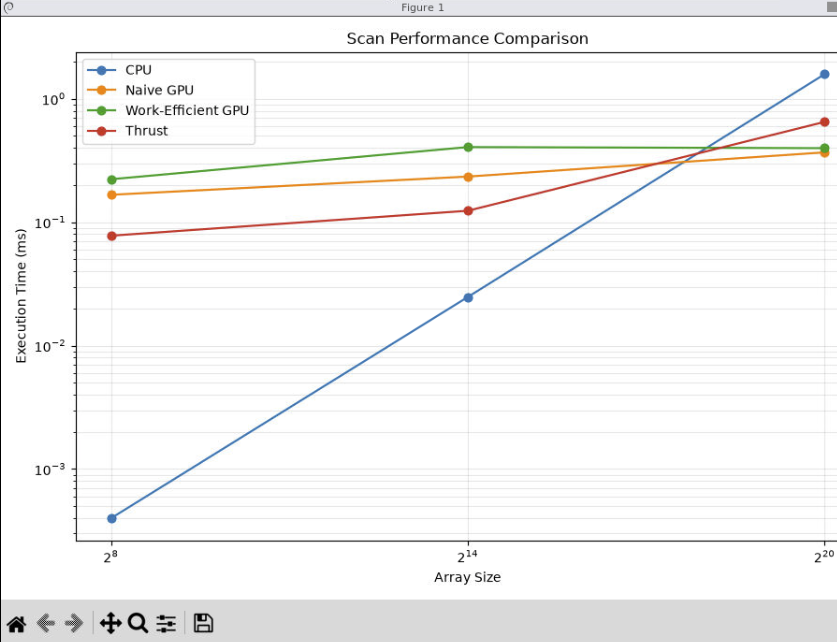

# CUDA Stream Compaction

**University of Pennsylvania, CIS 5650: GPU Programming and Architecture, Project 2**

* Rithik Rajaram
* Tested on: Windows 11, Intel Core i9-12900K, NVIDIA GeForce RTX 3080 Ti 12 GB

## Overview

This project implements several prefix-sum and stream-compaction algorithms on the CPU and GPU using CUDA.

The project includes:

- Serial CPU exclusive scan
- Serial CPU stream compaction without scan
- Serial CPU stream compaction using map, scan, and scatter
- Naive parallel CUDA scan
- Work-efficient CUDA scan
- Work-efficient CUDA stream compaction
- Thrust exclusive scan
- **Extra Credit:** Optimized work-efficient scan with reduced inactive-thread launches
- **Extra Credit:** GPU radix sort using the work-efficient scan

All scan implementations perform an exclusive prefix sum.

For example:

```text
Input:
[1, 5, 0, 1, 2, 0, 3]

Exclusive scan:
[0, 1, 6, 6, 7, 9, 9]
```

Stream compaction removes all zero-valued elements:

```text
Input:
[1, 5, 0, 1, 2, 0, 3]

Output:
[1, 5, 1, 2, 3]
```

## Implementation

### CPU Scan

The CPU scan performs a serial exclusive prefix sum using a simple loop.

For each output index `i`, the result contains the sum of all input elements before `i`.

This implementation provides the reference output used to verify the GPU implementations.

### CPU Stream Compaction Without Scan

The direct CPU compaction implementation loops through the input array and maintains an output index.

Whenever a nonzero element is encountered, it is written to the next available output position.

This produces a compact array in a single serial pass.

### CPU Stream Compaction With Scan

The scan-based CPU implementation follows the same three-stage structure used by the GPU implementation:

1. **Map** each input value to `1` if it is nonzero and `0` otherwise.
2. **Exclusive scan** the mapped array to determine output indices.
3. **Scatter** nonzero elements into the resulting compacted array.

For example:

```text
Input:
[1, 5, 0, 1, 2, 0, 3]

Mapped:
[1, 1, 0, 1, 1, 0, 1]

Scanned:
[0, 1, 2, 2, 3, 4, 4]

Output:
[1, 5, 1, 2, 3]
```

### Naive GPU Scan

The naive CUDA implementation performs a parallel scan using double buffering.

At scan level `d`, every element combines its current value with the element `2^d` positions before it when such an element exists.

This requires approximately `log2(N)` kernel launches and performs `O(N log N)` total work.

The original input is shifted by one position so that the final result is an exclusive scan.

### Work-Efficient GPU Scan

The work-efficient implementation uses the Blelloch scan algorithm.

It consists of:

1. **Up-sweep:** build a tree of partial sums.
2. Set the final tree element to zero.
3. **Down-sweep:** propagate prefix sums down the tree.

This performs `O(N)` total arithmetic work.

The algorithm requires a power-of-two-sized working array, so non-power-of-two inputs are padded with zeroes to the next power of two.

### Work-Efficient GPU Compaction

GPU stream compaction uses three stages:

1. Map each input element to a boolean `0` or `1`.
2. Scan the boolean array using the work-efficient scan.
3. Scatter each nonzero input element to its scanned output index.

The map and scatter stages are parallel CUDA kernels.

### Thrust Scan

The Thrust implementation wraps:

```cpp
thrust::exclusive_scan(
    d_input.begin(),
    d_input.end(),
    d_output.begin()
);
```

Input/output allocation and host-device transfers are performed outside the measured timing interval so that the reported GPU time measures the scan operation itself.

## Performance Analysis

### Testing Methodology

Performance tests were run in **Release mode without debugging**.

The tested scan implementations were:

- Serial CPU
- Naive CUDA
- Work-efficient CUDA
- Thrust

GPU timings use CUDA events, while CPU timings use `std::chrono`.

Initial and final allocation and host-device memory transfers were excluded from the GPU scan timing.

Three input sizes were tested:

- `2^8 = 256`
- `2^14 = 16,384`
- `2^20 = 1,048,576`

### CUDA Block Size Analysis

Block sizes of 128, 256, and 512 threads were tested using an input size of `2^20`.

| Block Size | Naive Scan (ms) | Work-Efficient Scan (ms) |
| ---: | ---: | ---: |
| 128 | **0.391808** | 0.396128 |
| 256 | 0.908864 | 0.496832 |
| 512 | 0.594272 | **0.363392** |

The best measured block size for the naive implementation was **128 threads**, while the best measured block size for the work-efficient implementation was **512 threads**.

These values were used for the final performance comparison.

The differences were not monotonic with block size. Increasing the number of threads per block does not necessarily improve performance because occupancy, scheduling, resource use, and the amount of useful work performed by each kernel all affect execution time.

### Scan Performance



| Array Size | CPU (ms) | Naive GPU (ms) | Work-Efficient GPU (ms) | Thrust (ms) |
| ---: | ---: | ---: | ---: | ---: |
| 256 | 0.000400 | 0.166912 | 0.223168 | 0.077824 |
| 16,384 | 0.024800 | 0.234496 | 0.406528 | 0.123904 |
| 1,048,576 | 1.583600 | 0.368256 | 0.398464 | 0.650240 |

For small arrays, the serial CPU implementation is substantially faster than the GPU implementations. At only 256 elements, there is very little useful parallel work, so CUDA kernel-launch and synchronization overhead dominate the GPU execution time.

The same effect is still visible at 16,384 elements, where the CPU scan completes in approximately 0.025 ms while all GPU implementations require more time.

At 1,048,576 elements, the trend reverses. The GPU implementations have enough parallel work to overcome launch overhead:

- CPU: **1.5836 ms**
- Naive GPU: **0.3683 ms**
- Work-efficient GPU: **0.3985 ms**
- Thrust: **0.6502 ms**

At this size, the naive GPU scan was approximately **4.3x faster** than the serial CPU implementation, while the work-efficient implementation was approximately **4.0x faster**.

Although the work-efficient algorithm performs less theoretical work than the naive algorithm, it was slightly slower in this measurement. The work-efficient implementation requires separate up-sweep and down-sweep kernel launches and repeatedly accesses global memory. This overhead can outweigh the reduction in arithmetic work for the tested input sizes.

The scan workload itself performs relatively little computation per element, so memory access and kernel-launch overhead are important performance bottlenecks.

## Extra Credit: Work-Efficient Scan Optimization

The initial work-efficient implementation launched enough threads for `N / 2` operations at every level of the up-sweep and down-sweep.

At deeper tree levels, only a small fraction of those threads actually perform useful work. Near the root of the tree, only one or two operations may remain even though the original configuration could still launch enough threads for hundreds of thousands of elements.

I optimized the implementation by calculating the number of active threads separately at every tree level:

```cpp
int numThreads = n / (offset * 2);
int numBlocks = (numThreads + blockSize - 1) / blockSize;
```

This reduces unnecessary thread and block launches as the scan progresses deeper into the tree.

For the final `2^20` benchmark:

| Implementation | Time (ms) |
| --- | ---: |
| Serial CPU | 1.583600 |
| Work-Efficient GPU | 0.398464 |

The optimized work-efficient GPU scan was approximately **3.97x faster than the serial CPU scan** for an array of 1,048,576 elements.

The GPU is not faster for every input size. At smaller array sizes, kernel-launch and synchronization overhead dominate, so the serial CPU remains faster. Once the input becomes sufficiently large, the available GPU parallelism outweighs this overhead.

## Nsight Systems Analysis

I used NVIDIA Nsight Systems to inspect the CUDA execution timeline.

The custom kernels were clearly visible in the trace:

- `kernNaiveScan`
- `kernUpSweep`
- `kernDownSweep`
- `kernSetZero`
- `kernMapToBoolean`
- `kernScatter`

Thrust's scan appeared through the CCCL/CUB implementation as:

- `DeviceScanKernel`
- `DeviceScanInitKernel`

This indicates that Thrust uses optimized device-scan kernels rather than explicitly launching an up-sweep and down-sweep kernel for every scan-tree level.

In the complete program trace, `kernUpSweep` and `kernDownSweep` accounted for most of the recorded GPU kernel time because they are also repeatedly used by stream compaction and radix sort.

Nsight also showed host-to-device, device-to-host, device-to-device, and memset operations surrounding the GPU work. The initial and final memory operations for the scan implementations were excluded from the reported scan timings.

## Extra Credit: Radix Sort

A GPU radix-sort module was implemented using the work-efficient scan.

The implementation performs a least-significant-bit-first binary radix sort over 32-bit integers.

For each bit:

1. Map each value according to the current bit.
2. Exclusive-scan the mapped values.
3. Use the scan results to scatter elements into the correct partition.
4. Swap the input and output buffers.
5. Continue with the next bit.

The sort reuses the GPU-resident work-efficient scan so intermediate data remains on the GPU.

### Usage

```cpp
int input[] = {7, 2, 9, 1, 5};
int output[5];

StreamCompaction::Radix::sort(
    5,
    output,
    input
);
```

Example output:

```text
Input:
[7, 2, 9, 1, 5]

Output:
[1, 2, 5, 7, 9]
```

### Radix Sort Testing

I added correctness tests for both power-of-two and non-power-of-two input sizes.

The test procedure was:

1. Generate an unsorted integer array.
2. Copy the same input into a CPU reference array.
3. Sort the reference array using `std::sort`.
4. Run `StreamCompaction::Radix::sort` on the original input.
5. Compare the GPU radix-sort output against the CPU-sorted reference.

The final large-array tests used:

- Power-of-two: `N = 2^20 = 1,048,576`
- Non-power-of-two: `N = 2^20 - 3 = 1,048,573`

Both tests passed:

```text
radix sort, power-of-two:      11.6787 ms
passed

radix sort, non-power-of-two:  11.7709 ms
passed
```

The non-power-of-two case verifies that radix sort continues to work correctly when the underlying scan pads its intermediate storage to the next power of two.

## Test Output

The following output was collected using an input size of `2^20`.

Additional radix-sort correctness tests were added to the provided test program.

```text
****************
** SCAN TESTS **
****************
    [  17  15  41  11  38   4  49  11  14  19  11  36   3 ...  49   0 ]
==== cpu scan, power-of-two ====
   elapsed time: 1.5836ms    (std::chrono Measured)
    [   0  17  32  73  84 122 126 175 186 200 219 230 266 ... 25665494 25665543 ]
==== cpu scan, non-power-of-two ====
   elapsed time: 1.6126ms    (std::chrono Measured)
    [   0  17  32  73  84 122 126 175 186 200 219 230 266 ... 25665446 25665446 ]
    passed
==== naive scan, power-of-two ====
   elapsed time: 0.368256ms    (CUDA Measured)
    passed
==== naive scan, non-power-of-two ====
   elapsed time: 0.273408ms    (CUDA Measured)
    passed
==== work-efficient scan, power-of-two ====
   elapsed time: 0.398464ms    (CUDA Measured)
    passed
==== work-efficient scan, non-power-of-two ====
   elapsed time: 0.674432ms    (CUDA Measured)
    passed
==== thrust scan, power-of-two ====
   elapsed time: 0.65024ms    (CUDA Measured)
    passed
==== thrust scan, non-power-of-two ====
   elapsed time: 0.359424ms    (CUDA Measured)
    passed

*****************************
** STREAM COMPACTION TESTS **
*****************************
    [   3   3   3   3   0   0   3   3   0   1   3   2   3 ...   3   0 ]
==== cpu compact without scan, power-of-two ====
   elapsed time: 1.8668ms    (std::chrono Measured)
    [   3   3   3   3   3   3   1   3   2   3   1   1   2 ...   3   3 ]
    passed
==== cpu compact without scan, non-power-of-two ====
   elapsed time: 1.8162ms    (std::chrono Measured)
    [   3   3   3   3   3   3   1   3   2   3   1   1   2 ...   2   3 ]
    passed
==== cpu compact with scan ====
   elapsed time: 5.0195ms    (std::chrono Measured)
    [   3   3   3   3   3   3   1   3   2   3   1   1   2 ...   3   3 ]
    passed
==== work-efficient compact, power-of-two ====
   elapsed time: 0.69632ms    (CUDA Measured)
    passed
==== work-efficient compact, non-power-of-two ====
   elapsed time: 0.3584ms    (CUDA Measured)
    passed

**********************
** RADIX SORT TESTS **
**********************
==== radix sort, power-of-two ====
   elapsed time: 11.6787ms    (CUDA Measured)
    passed
==== radix sort, non-power-of-two ====
   elapsed time: 11.7709ms    (CUDA Measured)
    passed
Press any key to continue . . .
```

## Build Notes

The provided CMake configuration required small changes for compatibility with the Windows and CUDA 13.3 development environment.

The top-level CMake configuration was updated to locate the CUDA Toolkit explicitly and enable MSVC's standards-conforming preprocessor.

The `stream_compaction` CMake configuration was also updated to include the additional radix-sort source and header files.

## Conclusions

The experiments demonstrate that GPU scan performance depends strongly on problem size.

For small inputs, the serial CPU implementation is faster because GPU launch and synchronization overhead dominate the small amount of actual work.

As the input size increases, the GPU implementations become significantly faster. At `2^20`, both custom CUDA implementations and Thrust outperformed the serial CPU scan.

The naive scan performs more total work than the work-efficient algorithm, but its simpler execution structure allowed it to perform slightly better than the custom work-efficient implementation in the final large-array test.

The work-efficient implementation reduces arithmetic complexity to `O(N)`, but separate up-sweep and down-sweep kernel launches and global-memory accesses remain significant bottlenecks.

Reducing the number of inactive threads at deeper scan-tree levels improved the work-efficient implementation and produced a scan approximately **3.97x faster than the serial CPU implementation at `2^20`**.

The radix-sort extension demonstrates how scan can be used as a fundamental building block for more complex parallel algorithms.